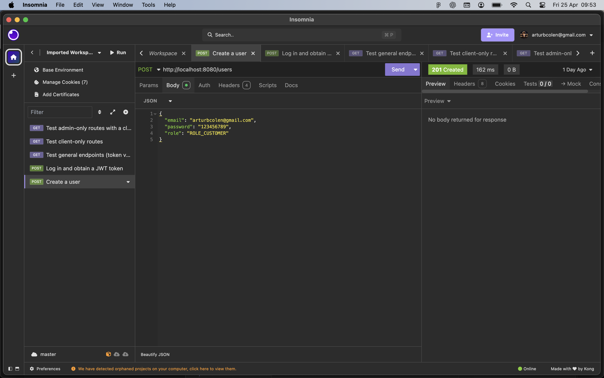
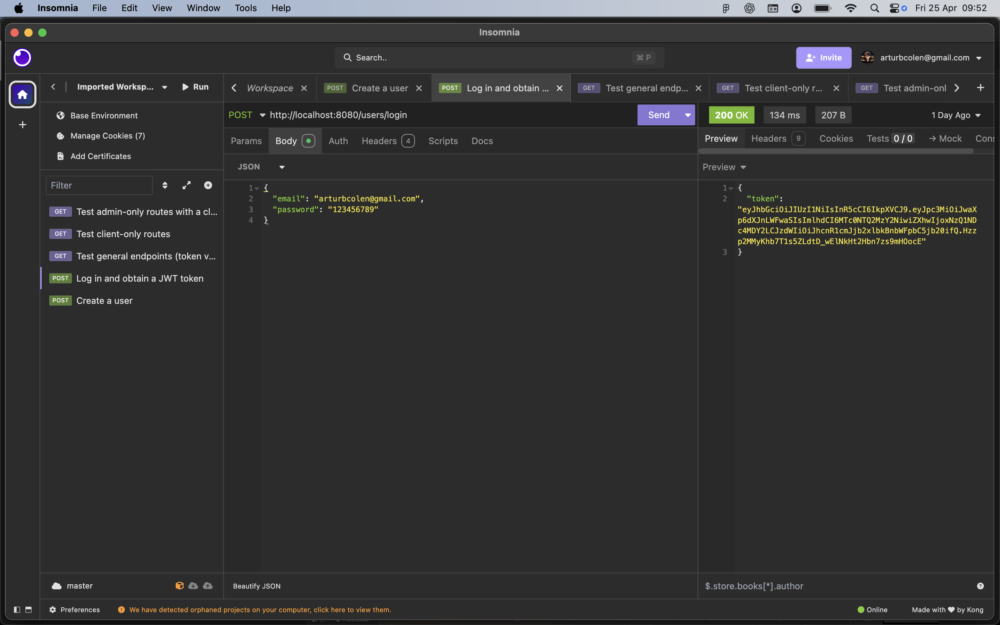
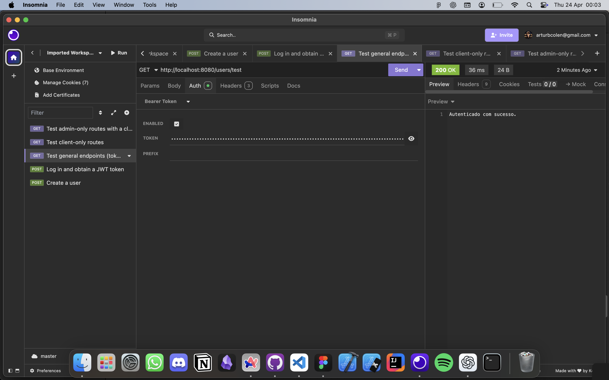
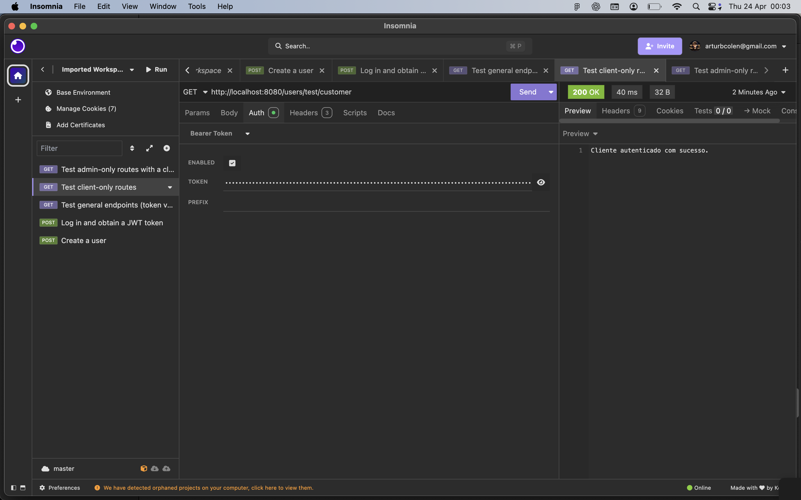
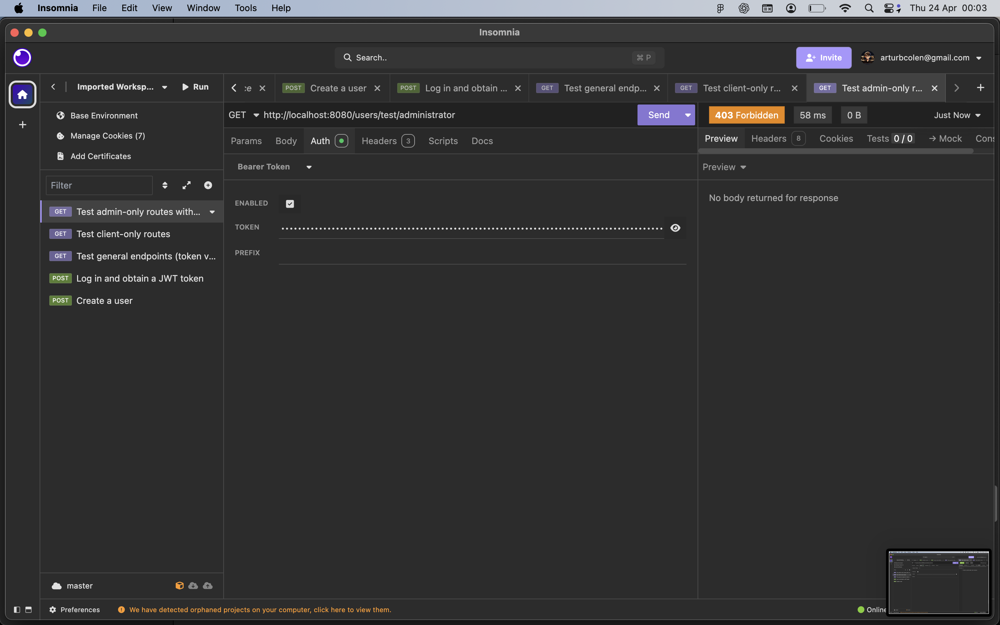

<div  align="center" id="about">
	<h1 align="center">
        SecureAuth API
    </h1>
    <p align="center">
        SecureAuth API is a simple, introductory RESTful service designed to explore the fundamentals of token-based security with Spring Boot. Leveraging Spring Security and JWT, this project demonstrates basic user registration, authentication, and protected resource access, offering a hands-on learning experience for implementing secure Java backend applications.
    </p>
	
</div>
<br>
<div align="center">
    <a href="https://docs.oracle.com/en/java/" target="_blank"></a>
    <a href="https://docs.spring.io/spring-boot/index.html" target="_blank"></a>
    <a href="https://convert2base.vercel.app/" target="_blank"></a>
    <a href="https://github.com/SpaceForDevelopment/Convert2Base-Package/blob/main/LICENSE.md" target="_blank"></a>
</div>

<div id="table-of-contents"></div>

## 📋 Table of Contents

- [About](#about)
- [Table of Contents](#table-of-contents)
- [Features](#features)
- [Application Demonstration](#application-demonstration)
- [Setup and Run the Application](#setup-and-run-the-application)
- [Technologies](#technologies)
- [Author](#author)
- [License](#license)

<div id="features"></div>

## 📝 Features

All API routes for the listed features have been fully developed and are functional. As this project is purely educational, there is no front-end implementation. Below is a detailed list of the features and their status:

- [x] User registration
- [x] User login
- [x] Client-only route access
- [x] Administrator-only route access
- [x] Token validation

<div id="application-demonstration"></div>

## 📲 Application Demonstration

Since this is a backend API, you can test it locally using Insomnia or other API testing services like Postman. Below are the images showcasing the typical workflow:

- Create a user



- Log in and obtain a JWT token



- Test general endpoints (token validation)



- Test client-only routes



- Test admin-only routes with a client token (results in failure due to lack of admin permission)



<div id="setup-and-run-the-application"></div>

## 📁 Setup and Run the Application

### ⚙️ Prerequisites

Before starting, you need to have the following tools installed on your machine: [Git](https://git-scm.com) and [Java 21+](https://www.oracle.com/br/java/technologies/downloads/).

It’s also recommended to use an IDE like [Visual Studio Code](https://code.visualstudio.com/) (with the Java Extension Pack) or [IntelliJ IDEA](https://www.jetbrains.com/idea/).

### 🚀 How to Run the Application

#### Back-End Setup

```bash
# Clone this repository
$ git clone https://github.com/ArturColen/secure-rest-api-spring-boot-jwt.git

# Navigate to the project folder
$ cd secure-rest-api-spring-boot-jwt

# Run the application
# Option 1: If using an IDE, open the project and run the main class (annotated with @SpringBootApplication)
# Option 2: If using the terminal, run the following command:
$ ./mvnw spring-boot:run
```

The server will start on port 8080 by default — you can now test the API using tools like [Insomnia](https://insomnia.rest/download) or [Postman](https://www.postman.com/downloads/).

<div id="technologies"></div>

## 💻 Technologies

The following tools and frameworks were used in the development of this project:

- [**Java**](https://docs.oracle.com/en/java/): A high-level, class-based, object-oriented programming language designed for reliability and platform independence.
- [**Spring Boot**](https://docs.spring.io/spring-boot/docs/current/reference/html/): A framework for building production-ready applications with minimal configuration.
- [**Spring Data JPA**](https://docs.spring.io/spring-data/jpa/docs/current/reference/html/): A module of Spring for data access using the Java Persistence API (JPA).
- [**Spring Web**](https://docs.spring.io/spring-framework/docs/current/reference/html/web.html): A module of Spring for building web applications, including RESTful services.
- [**Spring Security**](https://docs.spring.io/spring-security/reference/): A powerful and customizable authentication and access-control framework.
- [**Lombok**](https://projectlombok.org/): A Java library that helps reduce boilerplate code by generating common methods like getters and setters.
- [**H2 Database**](https://www.h2database.com/html/main.html): A lightweight, in-memory database often used for development and testing.
- [**JWT (JSON Web Tokens)**](https://jwt.io/introduction): A compact, URL-safe means of representing claims to be transferred between two parties.
- [**Auth0**](https://auth0.com/docs): A platform for implementing authentication and authorization in applications.

<div id="author"></div>

## 👨🏻‍💻 Author

---

| [<br><sub>Artur Bomtempo</sub>](https://arturbomtempo.dev/) |
| :--------------------------------------------------------------------------------------------------------------------------------------------------: |

Developed by Artur Bomtempo 👋🏻. Get in touch:

[](mailto:arturbcolen@gmail.com)
[](https://www.linkedin.com/in/artur-bomtempo/)
[](https://www.instagram.com/arturbomtempo.dev/)

<div id="license"></div>

## 📜 License

Copyright (c) 2025 Artur Bomtempo Colen

Permission is hereby granted, free of charge, to any person obtaining a copy
of this software and associated documentation files (the "Software"), to deal
in the Software without restriction, including without limitation the rights
to use, copy, modify, merge, publish, distribute, sublicense, and/or sell
copies of the Software, and to permit persons to whom the Software is
furnished to do so, subject to the following conditions:

The above copyright notice and this permission notice shall be included in all
copies or substantial portions of the Software.

THE SOFTWARE IS PROVIDED "AS IS", WITHOUT WARRANTY OF ANY KIND, EXPRESS OR
IMPLIED, INCLUDING BUT NOT LIMITED TO THE WARRANTIES OF MERCHANTABILITY,
FITNESS FOR A PARTICULAR PURPOSE AND NONINFRINGEMENT. IN NO EVENT SHALL THE
AUTHORS OR COPYRIGHT HOLDERS BE LIABLE FOR ANY CLAIM, DAMAGES OR OTHER
LIABILITY, WHETHER IN AN ACTION OF CONTRACT, TORT OR OTHERWISE, ARISING FROM,
OUT OF OR IN CONNECTION WITH THE SOFTWARE OR THE USE OR OTHER DEALINGS IN THE
SOFTWARE.
